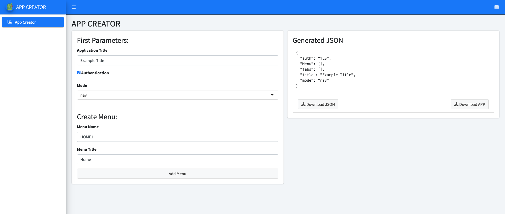
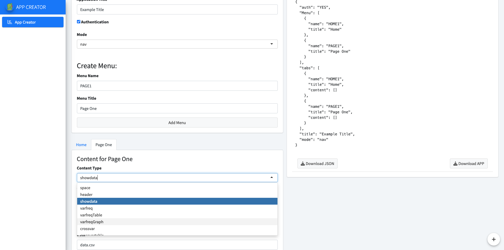

# Shiny App JSON Creator

## Introduction

This Shiny App allows users to generate a JSON file that describes an entire Shiny application. It is designed for non-programmers who want to create a Shiny app without needing to write R code. By simply filling out form fields and selecting options, users can build a full Shiny app structure, complete with authentication, different modules, and flexible layout options.

## Key Features

1.  Create an App with JSON The app lets you create a JSON file that defines the structure and components of a Shiny app. This JSON file can then be used to generate a Shiny app. Users can define menus, tabs, and content such as tables, graphs, videos, and images, all through an easy-to-use interface.

2.  Authentication Authentication can be enabled for the generated Shiny app. This allows the app to provide access to different versions or entirely different apps, depending on the user's credentials. Each version can utilize different modules and offer varying functionalities, enabling personalized user experiences.

3.  Modularization The app takes advantage of a modular approach, meaning that functionalities are organized into modules. This makes it easy to add new features to the app, and users can choose to include or exclude specific modules in their generated app. The modular system also allows for the flexible arrangement of components, so users can organize their app layout however they wish.

## How to Use

### Fill in App Parameters:

-   Set the application title
-   Select the mode (navigation or dashboard)

### Create Menus and Tabs:

-   Define menus
-   Define tabs for each menu
-   Each tab can contain various types of content

### Add Content:

-   Select from a variety of content types (data tables, frequency graphs, images, videos)
-   Add custom modules for variable crossings (e.g., CrossVarUITable, CrossVarUIGraph) to include more advanced functionality

### Generate JSON:

Once the app is fully configured, a JSON file is generated that contains all the information needed to describe the Shiny app structure. This JSON can be downloaded and used to create the actual Shiny app in R.

## Benefits

-   Non-Coders Friendly This app is aimed at users who do not have experience with R programming but still wish to design a functional and customized Shiny application.

-   Dynamic and Scalable The modular nature of the app means that new features can easily be added over time, and users can decide which modules to include in their specific app.

-   Flexible Layouts The app's design makes it possible to organize the app's structure as desired, giving users full control over the layout and functionality.

## Example Use Cases

-   Data Dashboards: Quickly create dashboards to visualize data without needing to write R code.
-   Personalized User Experience: Use authentication to provide different users with different versions of the app based on their access level.
-   Custom Modules: Modularization makes it easy to integrate custom content and functionalities, such as custom tables or graphs for specific data.

## Getting Started

To get started, download the app and run it in a Shiny environment. Follow the UI to set up the parameters of your app, then generate the JSON file which will describe your app's structure.
